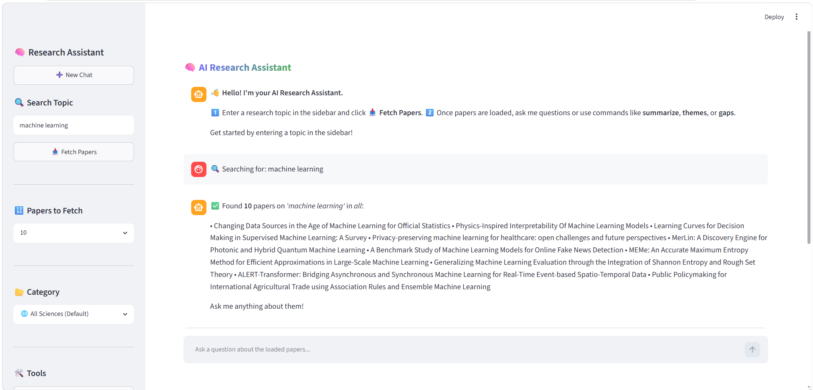

# AI Research Assistant for Literature Review

## Overview

AI Research Assistant for Literature Review is an intelligent web-based application that helps researchers, students, and professionals efficiently explore research papers, generate summaries, identify common themes, discover research gaps, and interact with academic literature through a conversational interface.

The application automates several time-consuming aspects of the literature review process by combining Natural Language Processing (NLP), Semantic Search, Vector Databases, and Large Language Models.

---

## Features

### Research Paper Retrieval

* Fetches research papers directly from arXiv.
* Supports topic-based search across multiple research domains.
* Retrieves paper metadata including title, authors, publication date, abstract, and PDF links.

### AI-Powered Summarization

* Generates concise summaries of research papers.
* Helps users quickly understand key concepts and findings.

### Semantic Search

* Uses vector embeddings to understand contextual meaning.
* Retrieves relevant information beyond simple keyword matching.

### Theme Analysis

* Identifies common research themes across multiple papers.
* Extracts frequently occurring concepts and trends.

### Research Gap Detection

* Highlights underexplored topics and potential future research directions.
* Assists researchers in identifying opportunities for novel contributions.

### Conversational Question Answering

* Enables users to ask natural language questions about loaded papers.
* Provides context-aware answers using indexed research content.

### User Authentication & History

* Secure user login and registration.
* Saves research sessions and chat history for future reference.

---

## System Architecture

1. User enters a research topic.
2. Research papers are retrieved from arXiv.
3. Paper abstracts are converted into vector embeddings.
4. Embeddings are stored in ChromaDB.
5. Summarization and analysis modules process the papers.
6. Users interact with the literature through a chat interface.

---

## Technologies Used

### Programming Language

* Python

### Frontend

* Streamlit

### AI & NLP

* Transformers
* Sentence Transformers
* Natural Language Processing (NLP)

### Vector Database

* ChromaDB

### Academic Data Source

* arXiv API

### Database

* SQLite

### Machine Learning Libraries

* Scikit-learn
* NLTK

---

## Project Screenshots

### Dashboard



### Research Paper Retrieval


---

## Installation

### Clone Repository

```bash
git clone https://github.com/Manjunath9346/AI-Research-Assistant-Literature-Review.git

cd AI-Research-Assistant-Literature-Review
```

### Install Dependencies

```bash
pip install -r requirements.txt
```

### Run Application

```bash
streamlit run app.py
```

---

## Use Cases

* Literature Reviews
* Academic Research
* Research Trend Analysis
* Research Gap Identification
* Topic Exploration
* Knowledge Discovery

---

## Challenges Addressed

* Efficient retrieval of relevant research papers.
* Understanding large collections of academic publications.
* Identifying research trends and themes.
* Discovering potential research gaps.
* Improving accessibility of research knowledge through conversational AI.

---

## Future Enhancements

* Full PDF content analysis
* Citation network analysis
* Automatic literature review generation
* Advanced Retrieval-Augmented Generation (RAG)
* Multi-agent AI architecture
* Research recommendation engine
* Integration with additional academic repositories

---

## Author

**Manjunatha Shankarapu**

AI & Software Developer

GitHub: https://github.com/Manjunath9346

---

## License

This project is intended for educational, research, and portfolio purposes.
